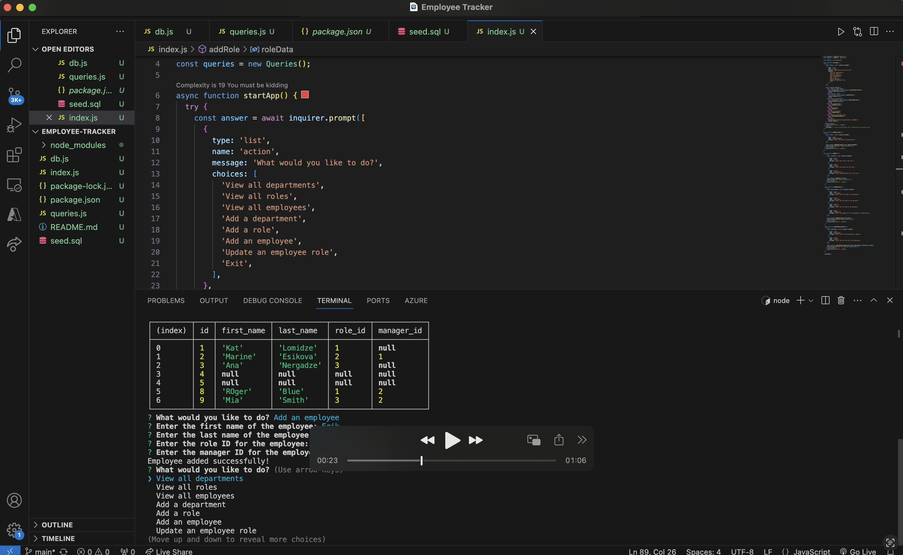

Employee Tracker

This is a command line application which manages a company's employee database using Node.js, Inquirer and MySQL.

USER STORY

AS A business owner
I WANT to be able to view and manage the departments, roles, and employees in my company
SO THAT I can organize and plan my business.

With this application, a user is able to view all employees, view all roles and view all departments.

They are also able to add employees along with their ID and manager ID number, add new roles and add new departments.

Here is a video walkthrough of this command line application:

